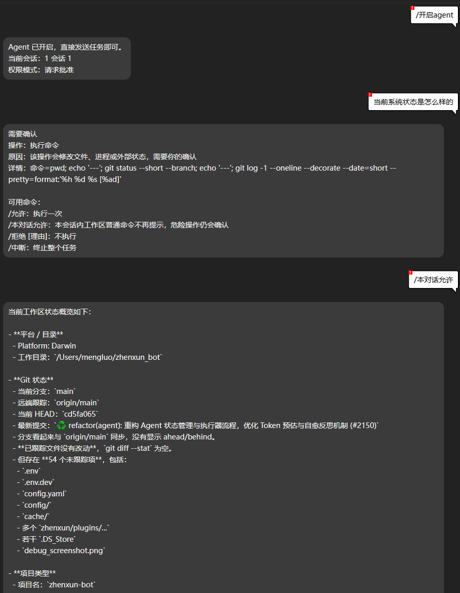

# ChatInter

ChatInter 是面向 [真寻 Bot](https://github.com/zhenxun-org/zhenxun_bot) 的 AI 对话与插件调度插件。它在消息未被其他插件处理时接管请求，并按场景选择群聊插件命令、普通私聊或超级用户 Agent。

> [!IMPORTANT]
> ChatInter 依赖真寻 Bot 的 AI 服务和默认聊天模型。群聊插件调度与超级用户 Agent 还要求模型及其 Provider 正确支持 Tool Calling。

## 运行场景

ChatInter 将能力隔离在三条运行链路中：

| 场景 | 触发方式 | 可用能力 |
| --- | --- | --- |
| 群聊插件选择 | 在群聊中 `@Bot`，且消息未被其他插件处理 | 检索公开插件命令、校验参数、调用选中的原生插件；未选中插件时转为聊天回复 |
| 普通私聊 | 私聊 Bot，且 Superuser Agent 未开启 | 多轮对话、记忆召回、图片理解；不暴露插件命令或系统工具 |
| Superuser Agent | 超级用户私聊执行 `/开启agent` 后发送任务 | 文件读写、目录与内容检索、Shell 命令、产物读取、审批、会话管理 |

群聊插件选择只会暴露当前用户有权使用的公开命令。管理员、超级用户专用、受限、已禁用或当前场景不可用的插件不会进入普通用户的候选集。

## 主要能力

- 从插件元数据、Alconna 命令和 matcher 构建插件知识库与命令索引
- 结合本地召回、能力约束和 LLM Tool Calling 选择并执行插件命令
- 识别文本、图片、回复、`@` 对象和昵称目标，执行前校验参数与场景要求
- 群聊、私聊和 Superuser Agent 使用独立的工具边界与上下文策略
- 持久化完整消息时间线，并进行会话记忆、人物信息和相关历史召回
- 合并同一会话内的连续消息，避免多个耗时请求并发覆盖回复
- 根据 Provider 能力调整工具 Schema、工具选择模式与多模态输入
- 支持主模型失败重试和备用模型切换
- 提供路由、插件执行和反思统计，便于排查误触发与执行失败
- Superuser Agent 提供只读、请求批准和完全访问三种权限模式

## 安装

1. 将仓库中的 `chatinter/` 目录放入真寻 Bot 的插件目录。
2. 安装附加依赖：

   ```bash
   pip install -r chatinter/requirements.txt
   ```

3. 在真寻 Bot 配置中设置 `AI.DEFAULT_MODELS.chat`，或在 ChatInter 的 `AGENTS` 配置中为每类 Agent 指定模型。
4. 启动 Bot。日志出现 `ChatInter 插件已加载` 后，插件会预热插件知识库并在启动后补扫动态 matcher。

## 配置

ChatInter 会注册以下配置项：

| 配置键 | 说明 | 默认值 |
| --- | --- | --- |
| `ENABLED` | 是否启用 ChatInter | `true` |
| `AGENTS` | 三类 Agent 的模型、上下文窗口、最大输出和推理强度 | 见下方示例 |
| `FALLBACK_MODELS` | 主模型不可用时依次尝试的备用模型 | `[]` |
| `PERMISSIONS` | Superuser Agent 的权限预设、默认模式和危险操作策略 | 见下方示例 |

完整配置示例：

```yaml
# data/config.yaml
chatinter:
  ENABLED: true

  AGENTS:
    chat:
      model: DEFAULT_MODELS
      context_window_tokens: 64000
      max_output_tokens: 12000
      reasoning_effort: MEDIUM
    plugin:
      model: DEFAULT_MODELS
      context_window_tokens: 16000
      max_output_tokens: 2048
      reasoning_effort: MEDIUM
    superuser:
      model: DEFAULT_MODELS
      context_window_tokens: 200000
      max_output_tokens: 32000
      reasoning_effort: HIGH

  FALLBACK_MODELS: []

  PERMISSIONS:
    preset: python
    default_mode: ask
    dangerous_policy: ask
    allow: []
    ask: []
    dangerous: []
    deny: []
```

### Agent 配置说明

- `model`：模型名称。`DEFAULT_MODELS` 表示读取真寻 Bot 的 `AI.DEFAULT_MODELS.chat`。
- `context_window_tokens`：ChatInter 允许使用的输入窗口上限；若模型声明的窗口更小，以较小值为准。
- `max_output_tokens`：单次模型回复的最大输出 token 数。
- `reasoning_effort`：支持 `DEFAULT`、`NONE`、`MINIMAL`、`LOW`、`MEDIUM`、`HIGH`、`XHIGH`、`MAX`。Provider 不支持的等级可能会被其适配层忽略或降级。
- `FALLBACK_MODELS`：填写模型名称列表。瞬时错误会先有限重试，符合切换条件时再按列表顺序降级。

`chat` 用于普通对话和群聊未命中插件后的回复，`plugin` 用于群聊插件选择，`superuser` 用于超级用户 Agent。

### 权限配置说明

- `preset`：内置权限预设，当前支持 `python` 和 `none`。
- `default_mode`：新 Superuser Agent 会话的权限模式，可选 `ask`、`read_only`、`full_access`。
- `dangerous_policy`：危险操作命中后使用 `ask` 请求确认，或使用 `deny` 直接拒绝。
- `allow`、`ask`、`dangerous`、`deny`：附加匹配规则，例如 `Shell(pytest*)` 或 `File(@workspace/**)`。

在 `ask` 和 `read_only` 模式下，默认策略会拒绝凭据目录、`.env`、`.git`、云服务配置等敏感路径，并拦截关机、格式化磁盘等破坏性命令。`full_access` 会绕过这些权限规则，只应在完全信任当前任务和运行环境时临时启用。

## 使用

### 群聊与私聊

- 群聊中 `@Bot` 后直接描述需求，例如“帮我查一下上海明天的天气”。
- 如果插件命令缺少图片、目标用户或必要参数，ChatInter 会返回明确的补充提示。
- 普通私聊直接发送文本、图片或回复消息即可。
- 当前 turn 正在处理时，紧接着发送的短补充消息会并入同一会话队列。

私聊只接受文本、图片和回复消息段；包含其他不支持消息段的请求会被跳过。

### 管理命令

以下命令仅限超级用户，且需要在对应场景中发送：

| 命令 | 作用 |
| --- | --- |
| `重置会话` | 将当前群聊或私聊的 ChatInter 历史标记为已重置 |
| `chatinter统计` | 查看最近的路由、插件执行和反思统计 |
| `重建插件索引` | 强制重新扫描插件并重建知识库索引 |

### Superuser Agent

Superuser Agent 仅在超级用户私聊中可用。先发送 `/开启agent`，之后直接描述任务；发送 `/退出agent` 会退出 Agent 模式但保留会话。

| 分类 | 命令 |
| --- | --- |
| Agent | `/开启agent`、`/退出agent`、`/agent帮助`、`/状态`、`/中断` |
| 上下文 | `/清除上下文`、`/压缩上下文` |
| 权限 | `/请求批准模式`、`/只读模式`、`/完全访问模式` |
| 会话 | `/新增会话 [名称]`、`/当前会话`、`/列出会话`、`/切换会话 [ID/名称]`、`/重命名会话 ID/名称 新名称` |
| 归档 | `/归档会话 [ID/名称]`、`/列出归档会话`、`/恢复会话 ID/名称`、`/删除会话 ID/名称` |
| 审批 | `/允许`、`/本对话允许`、`/拒绝 [理由]`、`/中断` |

`/允许` 只批准当前待执行操作；`/本对话允许` 会在当前会话内记住同一权限范围。任务执行期间不能切换、清除、归档或删除当前会话，请先使用 `/中断`。

> [!NOTE]
> 仓库包含 MCP 连接与 Provider 适配模块，但当前启用的 Superuser Agent 工具集仅注册本地文件、Shell 和产物工具，尚未自动加载 `MCP_SERVERS`。因此 README 暂不提供 MCP 配置作为可用功能。

## 工作流程

```text
消息进入
  -> 已由其他插件处理？是：跳过
  -> 解析场景
     |-- 群聊：构建命令候选 -> Agent 选择/调用原生插件
     |                         -> 未选择插件时生成聊天回复
     |-- 普通私聊：构建身份、线程、记忆与图片上下文 -> 生成回复
     `-- 超级用户私聊且 Agent 已开启：恢复会话 -> 工具调用/审批 -> 保存结果
  -> 持久化时间线与反馈
  -> 发送最终回复
```

## 项目结构

```text
chatinter/
├── plugin_entry.py              # NoneBot 入口、matcher、管理命令与生命周期
├── config.py                    # 注册配置、模型与权限配置读取
├── handler.py                   # fallback 入口与 TurnFrame 构建
├── scenario_router.py           # 群聊、私聊、Superuser Agent 场景隔离
├── prompt_pipeline.py           # 对话处理流水线
├── pipeline_stages.py           # 身份、上下文、记忆、生成、持久化阶段
├── group_plugin_flow.py         # 群聊插件候选、选择、执行与聊天降级
├── command_index.py             # 插件命令索引与候选召回
├── capability_registry.py       # 命令与工具能力注册
├── provider_capability.py       # Provider 能力与 Schema 适配
├── provider_failover.py         # 重试、上下文恢复与备用模型切换
├── turn_queue.py                # 同会话消息排队与连续消息合并
├── memory.py                    # 对话历史与记忆入口
├── models/chat_history.py       # ChatInter 历史数据表
├── agents/
│   ├── plugin_command_agent.py  # 群聊插件命令 Agent
│   ├── chat_reply_agent.py      # 无工具聊天 Agent
│   └── superuser_entry.py       # Superuser Agent 直接入口
├── superuser_agent/
│   ├── runtime.py               # Agent 工具调用循环
│   ├── store.py                 # 会话与运行状态
│   ├── permission_policy.py     # 权限模式、规则匹配与会话授权
│   ├── runtime_approval.py      # 待审批操作恢复
│   └── tools/                   # 文件、Shell 与产物工具
└── utils/
    ├── multimodal.py            # 图片与回复链解析
    └── unimsg_utils.py          # UniMessage 转换
```

## 数据与日志

- 对话历史保存在数据库表 `chatinter_chat_history`，包含兼容摘要字段和完整 `timeline`。
- Superuser Agent 的会话、运行快照、审批和反馈保存在 `data/chatinter_agent/`。
- 生成或登记的产物保存在 `data/chatinter_artifacts/`。
- 插件与记忆向量索引保存在 `data/cache/chatinter/`。
- Superuser Agent 审计日志保存在 `data/log/chatinter_agent_audit.log`。

`重置会话` 对数据库历史执行软重置，不会直接删除记录。

## v1.4.0

- 将运行时拆分为插件命令、聊天回复和 Superuser 三类 Agent，收紧跨场景工具暴露
- 重构为基于 `TurnFrame` 的 Prompt Pipeline，并加入同会话 turn 队列
- 增强命令索引、两阶段 Schema 暴露、目标解析、原生插件执行与失败反馈
- 增加 Provider 协议适配、模型窗口约束、错误分类和备用模型切换
- 简化 Superuser Agent 工具集，补充权限模式、操作审批、会话归档与运行恢复
- 完善聊天时间线、长期记忆、人物信息、向量召回和多模态上下文

## 效果图



## 许可证

本项目采用 [AGPL-3.0](./LICENSE) 许可证。

## 致谢

- [绪山真寻 Bot](https://github.com/zhenxun-org/zhenxun_bot)
- [BYM AI 插件](https://github.com/zhenxun-org/zhenxun_bot_plugins/tree/main/plugins/bym_ai)
- Copaan：Agent 框架贡献

如有问题或建议，请提交 Issue。
